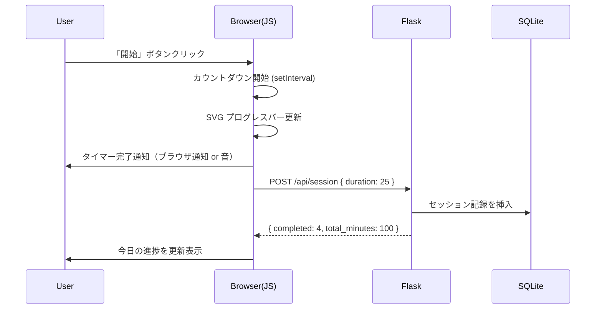

# ポモドーロタイマー Webアプリ アーキテクチャ設計書

## 概要

Flask（バックエンド）＋ HTML/CSS/JavaScript（フロントエンド）で構成するポモドーロタイマーアプリの設計方針をまとめたドキュメントです。

---

## ディレクトリ構成

```
1.pomodoro/
├── app.py                  # Flaskアプリケーション本体
├── requirements.txt        # 依存ライブラリ
├── static/
│   ├── css/
│   │   └── style.css       # スタイルシート
│   └── js/
│       └── timer.js        # タイマーロジック（フロントエンド）
└── templates/
    └── index.html          # メインページ
```

---

## 責務の分離

### Flask（`app.py`）の役割

タイマーのカウントダウン処理はすべてフロントエンドで行います。
Flaskはサーバーサイドの永続化（セッション記録の保存・取得）を担当します。

| エンドポイント  | メソッド | 役割                             |
| --------------- | -------- | -------------------------------- |
| `/`             | GET      | メインページ配信                 |
| `/api/session`  | POST     | セッション完了の記録（DB保存）   |
| `/api/today`    | GET      | 今日の進捗データ取得             |

### JavaScript（`timer.js`）の役割

- タイマーカウントダウン（`setInterval`）
- SVG による円形プログレスバーの描画・アニメーション
- 作業中 / 休憩中のフェーズ切替ロジック
- セッション完了時に Flask API へ `fetch()` で POST
- ページロード時に `/api/today` を `fetch()` して進捗を表示

---

## データストア

シンプルさを優先し、**SQLite**（Python 標準の `sqlite3` モジュール）を使用します。
セッションテーブル 1 本で今日の進捗管理が完結します。

```sql
CREATE TABLE sessions (
    id        INTEGER PRIMARY KEY AUTOINCREMENT,
    date      TEXT NOT NULL,    -- YYYY-MM-DD
    completed INTEGER NOT NULL, -- 完了ポモドーロ数
    duration  INTEGER NOT NULL  -- 集中時間（分）
);
```

---

## フロントエンド設計

UIモックの主要コンポーネントを以下のように実装します。

| UI 要素              | 実装方法                                                        |
| -------------------- | --------------------------------------------------------------- |
| 円形タイマー         | `<svg>` の `stroke-dashoffset` を JS でアニメーション           |
| タイマー表示（25:00）| `<span>` を JS で毎秒更新                                       |
| 開始 / リセットボタン| `<button>` ＋ イベントリスナー                                  |
| 今日の進捗パネル     | ページロード時に `/api/today` を `fetch()` して DOM に反映      |

---

## データフロー



---

## 技術的ポイント

- **タイマーはフロントエンドで完結**  
  サーバーとのリアルタイム通信（WebSocket 等）は不要。シンプルさと実装コストのバランスを優先します。

- **SVG 円形プログレスバー**  
  `stroke-dasharray` / `stroke-dashoffset` を用いることで、ライブラリなしに滑らかなアニメーションが実現できます。

- **Notification API**  
  タイマー完了時のブラウザ通知に使用します（ユーザーの許可が必要）。

- **依存ライブラリ**  
  アプリ実行は Flask のみですが、テスト実行のために `pytest` も依存に含めます。

  ```
  flask
  pytest
  ```
